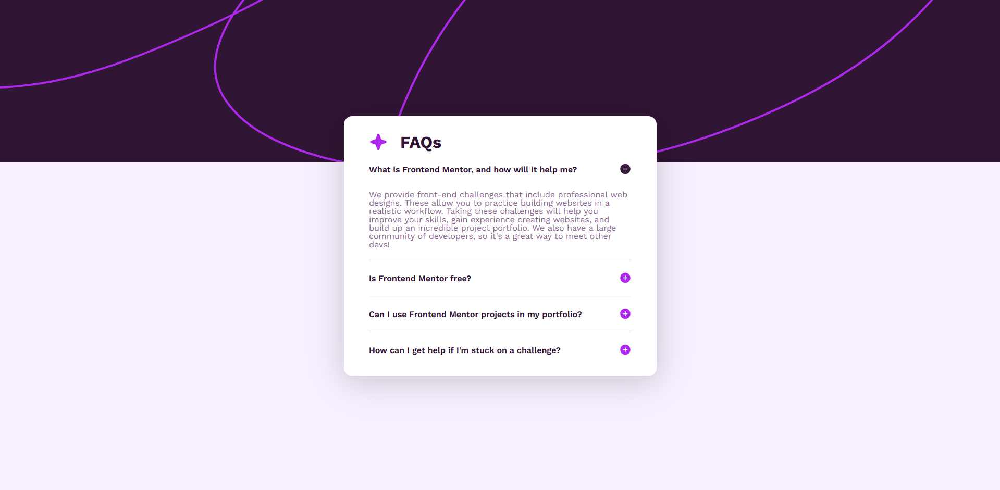

# O projeto

FAQ desenvolvido como parte de um [desafio do Frontend Mentor](https://www.frontendmentor.io/challenges/faq-accordion-wyfFdeBwBz/hub), a fim de praticar Angular.

## Para rodar

- [baixe o projeto](https://github.com/Krjorn/frontend-mentor-faq-accordion/archive/refs/heads/main.zip)
- na raiz do projeto execute: `npm install`
- em seguida: `npm run start-all`